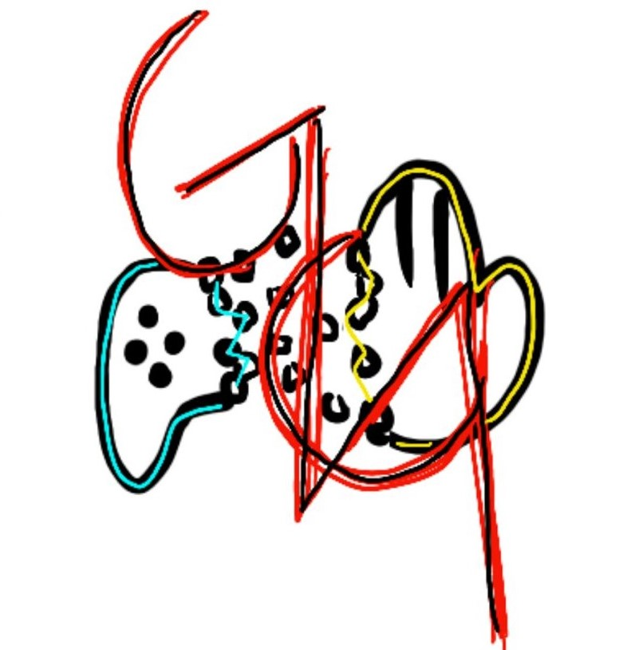

# The Gaming Gauntlet
University of Glasgow ENG5220: Real Time Embedded Programming Team Project

<!-- PROJECT SHIELDS -->

<!-- PROJECT LOGO -->
<br />

<p align="center">
  <a href="https://github.com/Kaixinwang99/The-Gaming-Gauntlet/">
    
  </a>

  <h3 align="center">"The Gaming Gauntlet</h3>
  <p align="center">
    A new generation controller
    <br />
    <a href="https://github.com/Kaixinwang99/The-Gaming-Gauntlet/"><strong>Get to know our gaming gauntlet »</strong></a>
    <br />
    <br />
    <a href="https://github.com/Kaixinwang99/The-Gaming-Gauntlet/">Demo</a>
    ·
    <a href="https://github.com/Kaixinwang99/The-Gaming-Gauntlet/issues">Report Bug</a>
    ·
    <a href="https://github.com/Kaixinwang99/The-Gaming-Gauntlet/issues">Add new feature</a>
  </p>

</p>

 
## Table of Contects
- [Introduction](#Introduction)
  - [Compatible-Games-and-keys](#Compatible-Games-and-Keys)
- [Installing](#Installing)  
  - [Configuration-Requirements](#Configuration-Requirements)
  - [Install-steps](#Install-steps)
- [Usage](#Usage)  
- [Project-Architecture](#Project-Architecture)
- [Contributing](#Contributing)
- [Version-Control](#Version-Control)
- [License](#License)
- [Acknowledgements](#Acknowledgements)

### Introduction 
The Gaming Gauntlet is the new generation of videogame controllers that aims to show the world a new way for people interact with consoles.

###### Compatible-Games-and-Keys
<b>Super Mario Bros pc - NES</b>
|Controller Key|Glove Commands|
|--------------|--------------|
| Jump | Thumb and index finger together |
| Move Left/Right | Rotate wrist left/right |
| Special Ability | Ring winger and thumb together |


<b>Mario Kart pc - NES</b>
|Controller Key|Glove Commands|
|--------------|--------------|
| Left/Right (A/S) | Move hand in front of the screen |
| Drift | Thumb and index finger together  |
| Object | Thumb and middle finger |
    

### Installing

###### Configuration-Requirements

1. Linux environment 
2. C++

###### Install-steps

1. Clone the repo

```sh
git clone https://github.com/Kaixinwang99/The-Gaming-Gauntlet.git
```
### Usage
a small video demo
### Project-Architecture
a random example in the website
eg:

```
filetree 
├── ARCHITECTURE.md
├── LICENSE.txt
├── README.md
├── /account/
├── /bbs/
├── /docs/
│  ├── /rules/
│  │  ├── backend.txt
│  │  └── frontend.txt
├── manage.py
├── /oa/
├── /static/
├── /templates/
├── useless.md
└── /util/

```

### Contributing

The project is built by a team from MSc student in University of Glasgow
* [Kaixin Wang](https://github.com/Kaixinwang99) 
* [Abhijith Vajjal Sampathkrishna](https://github.com/ajsampathk) 
* [Natalia Ibagon](https://github.com/nibagon) 
* [Marycarmen Flores Lopez](https://github.com/marycarmen1999) 


### Version-Control

This project is using Git to control the version, you can check the repository to see the avilabe version


### License

GNU General Public License v3.0

### Acknowledgements

