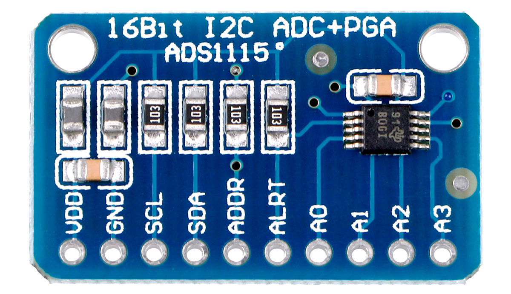

# Data acquisition with the ADS1115 on the Raspberry PI with callback handlers



The ADS1115 is a sigma delta converter which has a PGA and a
programmable sampling rate from 8Hz..860Hz. It's perfect for slowly
changing inputs such as pressure, temperature, heart rate etc.

This repo offers the class `ADS1115rpi` which manages the
communication between the ADS1115 and the client who just needs to
implement the callback `hasSample(float sample)` which is then called
at the requested sampling rate.

The class uses the ALERT/RDY pin of the ADS1115 connected to GPIO 17
to establish the sampling rate.


## Building:

To build:

    cmake .

    make

## Install

    sudo make install

## Usage example

In the subdir `example` is a simple application which prints
the ADC data to the screen or you can pipe it into a file.

    cd example
    sudo ./ads1115_printer

## General usage

The online doc is here: https://berndporr.github.io/rpi_ads1115/

You need to overload the abstract callback handler: ``` virtual void
hasSample(float v) { }; ``` with the functionality you'd like it to
do. You can switch the input channel within the callback handler to cycle
through different inputs.

Start the data acquisition:
```
myAD7705comm.start(settings)
```
Once `start` has been called `hasSample` will be called at the
specified sampling rate.

Stop the data acquisition:
```
myAD7705comm.stop();
```

## Author: Bernd Porr

   - bernd.porr@glasgow.ac.uk
   - mail@berndporr.me.uk
   - www.berndporr.me.uk
